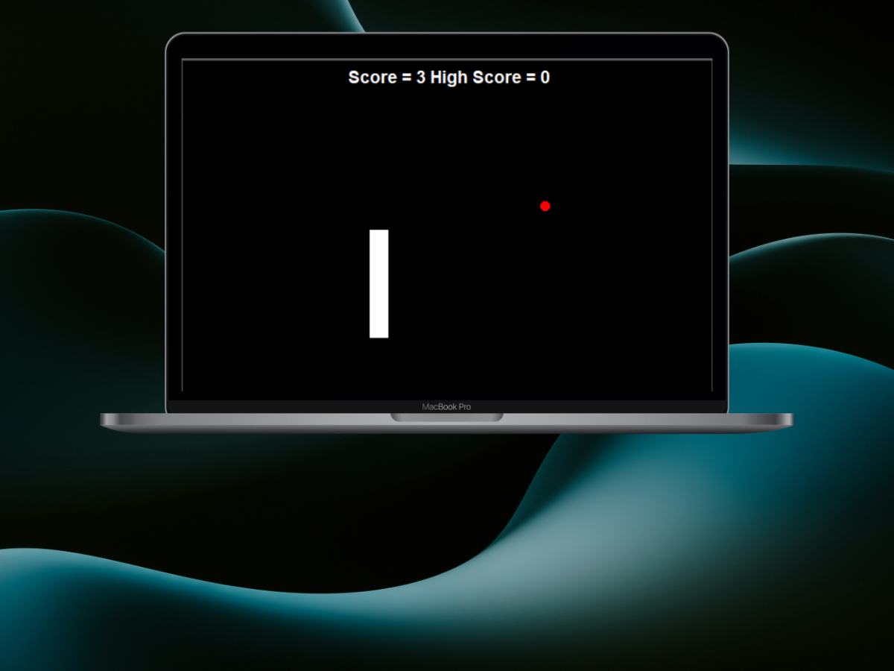

# Snake Game in Python

A classic Snake game implemented using Python's Turtle graphics library. The player controls the snake to eat food, growing in size as they go. The goal is to avoid collisions with the walls or the snake's own body. The game tracks the score and saves the highest score across game sessions.

## Features
- Snake controlled by arrow keys (`Up`, `Down`, `Left`, `Right`)
- Randomly generated food that increases the snake's length
- Score tracking, with a high score that is saved between sessions
- Collision detection for walls and the snake's own body
- Game reset when the player collides with a wall or the snake's body

## Installation

1. Make sure you have Python installed (version 3.6+ recommended).
2. Clone this repository:
    ```bash
    git clone https://github.com/ORomero227/Snake-Game.git
    ```
3. Navigate to the project directory:
    ```bash
    cd Snake-Game
    ```
4. Ensure you have the Turtle module installed. Turtle is a standard Python library, so no additional installation should be required.

## How to Play

1. Run the `main.py` file:
    ```bash
    python main.py
    ```
2. Use the arrow keys to control the snake:
   - `Up` arrow to move up
   - `Down` arrow to move down
   - `Left` arrow to move left
   - `Right` arrow to move right

3. The snake will grow each time it eats the food, and the player's score will increase.
4. Avoid collisions with the walls or the snake's own body to keep playing.
5. The high score is saved in the `highscore.txt` file.

## High Score System

The game keeps track of the highest score you've achieved in previous sessions by reading and writing to a file named `highscore.txt`. Make sure this file is in the same directory as the game to ensure proper functionality.

## Game Preview

  <!-- Optional: Add a screenshot of your game -->
